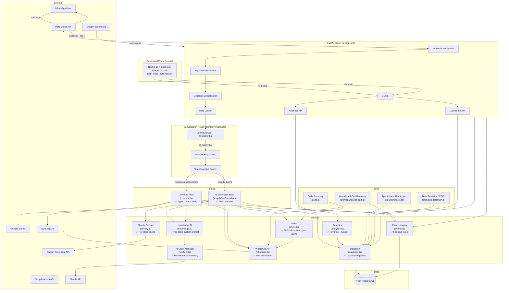

# Codebase & Business Audit Report

**Original audit:** 2026-04-18
**Last updated:** 2026-04-20 (post Phase 4)
**Auditor:** Claude (Staff Engineer / Product Strategist)
**Scope:** Full codebase, architecture, security, business analytics, growth readiness

---

## 1. Executive Summary

You have a working production product that real customers use to buy real products. The bot flow for ARAB is genuinely good — bilingual, graceful degradation, smart reprompting, and payment verification via Shopify webhooks.

Since the original audit, four phases of work have been completed:

**Phase 1 (original backlog):**
- **Security hardened:** Secrets rotated, .env removed from git history, customer PII masked in all logs.
- **Codebase restructured:** The 2,430-line shopify-agent.ts monolith was split into 5 focused modules. All client objects are now typed via a `ClientConfig` contract — no more `any` everywhere.
- **Test safety net built:** 93 unit tests covering 19 pure functions. Vitest runs instantly and never flakes.
- **Analytics foundation laid:** Events table captures every key action (messages, checkouts, payments, AI calls, escalations). Revenue attribution queries, conversion funnels, and usage summaries are available via API and CLI.
- **Business features added:** Abandoned cart recovery cron sends checkout link reminders to customers who don't complete payment. Revenue reports show per-client per-month revenue.
- **Documentation fixed:** architecture.md now matches reality (no phantom files, correct PostgreSQL state storage).

**Phase 2 (hardening):**
- **Token encryption:** Shopify tokens encrypted at rest with AES-256-GCM. Backward compatible with plaintext values.
- **Per-tenant rate limiting:** 200 msg/min per client prevents one tenant from exhausting WhatsApp API limits.
- **Centralized AI client:** Single Anthropic client manager with per-tenant concurrency control (max 5 concurrent).
- **AI cost tracking:** Token counts and latency captured on every AI call — visible via `/api/analytics/ai-cost`.
- **Product analytics:** Top products by checkout frequency — visible via `/api/analytics/products`.
- **Per-client system prompts:** Each client can customize their AI personality via `settings.system_prompt`.
- **Abandoned cart cron activated:** QStash POSTs every 30 minutes to trigger cart recovery.
- **Analytics API live:** `ANALYTICS_KEY` set in production, all 5 endpoints active.
- **Docs cleanup:** README and QUICK_START rewritten to match current codebase (removed stale Redis references).

**Phase 3 (PDPL + Observability):**
- **PDPL consent flow:** Customers see a consent prompt after language selection. Consent stored per-conversation with timestamp. Declining restarts the flow.
- **Data retention:** Automated 24-month retention cron. Anonymizes events and conversations (strips phone, keeps analytics). Deletes leads and appointments. QStash runs daily.
- **Right to deletion:** `DELETE /api/customer/:phone` removes all personal data across 4 tables.
- **Error spike detection:** 5-minute sliding window tracks error rates. System-wide spike alerts sent to owner when threshold (10 errors) is hit.
- **Per-client alerting:** When a client's service accumulates 5+ errors in 5 minutes, their agent phone gets an alert via their own WhatsApp credentials. 30-min cooldown prevents floods.
- **Health endpoint upgraded:** `/health` returns structured status (healthy/degraded/unhealthy) with DB connectivity, error rate, and uptime.
- **Daily summary:** QStash-triggered daily report sent to owner — messages, checkouts, payments, revenue, AI calls, errors.
- **Database indexes:** Added indexes on `updated_at`, `created_at`, and `phone` columns for efficient data retention and deletion queries.

**Phase 4 (Dashboard):**
- **Full analytics portal:** Next.js 16 + Shadcn/ui + Tailwind + Recharts. Separate deployment from backend.
- **Two-role auth:** Owner (ANALYTICS_KEY) sees everything. Client (per-client `dashboard_key`) sees only their data.
- **5 pages built:** Overview (KPI cards + revenue chart + funnel chart), Conversations (chat viewer + send message + filters + pagination), Analytics (usage + AI cost tables), Alerts (error history), Clients (owner-only client list with monthly stats).
- **All analytics endpoints upgraded:** Now accept both owner and client dashboard keys (not just ANALYTICS_KEY).
- **7 new API endpoints:** auth/validate, conversations list, conversation detail, send message, clients list, alerts, plus CORS support.
- **Auto-refresh:** All pages poll every 60 seconds with "last updated" indicator.
- **Dark mode:** Toggle in header, persisted to localStorage.

**What this means for the business:** You have a production-ready platform with legal compliance (PDPL), operational visibility (alerting + daily summaries + dashboard), and a client-facing portal where clients can see their own analytics and chat history. You can safely onboard new Shopify clients. The dashboard is your sales tool — show prospects real data.

---

## 2. Health Scores

| Area | Before | After Phase 2 | Now | What changed |
|------|--------|---------------|-----|-------------|
| **Code quality** | 5/10 | 7/10 | **7/10** | No major changes. Codebase is stable. |
| **Multi-tenant cleanliness** | 4/10 | 7/10 | **8/10** | Per-client dashboard keys. Per-client alerting. CORS isolation. |
| **Security** | 2/10 | 7/10 | **8/10** | PDPL consent, data retention, right-to-deletion. Remaining: data residency question. |
| **Observability** | 2/10 | 7/10 | **9/10** | Error spike detection, per-client alerts, daily summary, health endpoint, dashboard UI with charts. Remaining: no log aggregation service. |
| **Test coverage** | 1/10 | 5/10 | **5/10** | 93 unit tests unchanged. Still no integration/e2e tests. |
| **Documentation** | 6/10 | 7/10 | **7/10** | Dashboard PRD written. Still no API docs or runbook. |
| **Business analytics** | 1/10 | 8/10 | **9/10** | Full dashboard UI with charts, KPIs, conversation viewer. Clients can see their own data. |
| **Growth readiness** | 3/10 | 5/10 | **7/10** | Dashboard portal live. Client self-service view. Remaining: no self-serve onboarding. |

---

## 3. Architecture Map



---

## 4. Multi-Tenancy Review

### Where client-specific logic lives today:

| Concern | Where it lives | Status | Notes |
|---------|---------------|--------|-------|
| **Store name, domain** | `clients.settings` (DB) | ✅ Good | Read at runtime via typed `ClientSettings` |
| **Shopify tokens** | `clients.settings` (DB) | ✅ Encrypted | AES-256-GCM via `utils/crypto.ts` |
| **WhatsApp credentials** | `clients.access_token` + `phone_number_id` (DB) | ✅ Good | Per-client, typed in `ClientConfig` |
| **Currency** | `clients.settings.currency` with KWD fallback | ✅ Improved | Typed in `ClientSettings`, read via `getShopifyAgentConfig` |
| **Language/dialect** | Session-level (`conv.data._lang`) | ⚠️ OK | Works but no per-client default language |
| **Tone/personality** | `clients.settings.system_prompt` (DB) | ✅ Done | Per-client override, Gulf Arabic default fallback |
| **Product catalog** | Fetched from Shopify per-domain | ✅ Good | Cached per store+language |
| **System prompts** | `clients.settings.system_prompt` (DB) | ✅ Done | Overrides personality in knowledge.ts, ai-conversation.ts, and shopify/ai.ts |
| **Industry flow** | `clients.industry` in DB, routed in conversation.ts | ✅ Good | Clean routing |
| **Questions** | `clients.questions` in DB | ✅ Good | Per-client, typed as `ClientQuestion[]` |
| **Message templates** | Hardcoded by industry in messages.ts | ⚠️ OK | Per-industry, not per-client |
| **Business hours** | Not implemented | ❌ Not yet | Bot responds 24/7 |
| **Escalation rules** | `client.agent_phones` in DB | ✅ Good | Per-client, typed in `ClientConfig` |
| **Phone prefix → country** | Hardcoded in helpers.ts | ⚠️ OK | Works globally, now in its own module |
| **ARAB setup script** | `src/scripts/setup-arab.ts` | ⚠️ Remains | Client-specific script still in codebase |
| **Feature flags** | `clients.features` in DB | ✅ Good | Typed as `ClientFeatures` |
| **Dashboard access** | `clients.dashboard_key` in DB | ✅ New | Per-client 32-char key for portal login |
| **Service alerts** | `client.agent_phones[0]` via client credentials | ✅ New | Per-client error alerting with 30-min cooldown |

### Implemented Client Config Contract

The `ClientConfig` interface is now live in `src/types/client.ts`:

```typescript
interface ClientConfig {
  id: string;
  phone_number_id: string;
  name: string;
  industry: string;
  active: boolean;
  access_token: string;
  verify_token?: string;
  features: ClientFeatures;     // typed boolean flags
  settings: ClientSettings;     // typed shopify, currency, booking, etc.
  knowledge_base: KnowledgeItem[];
  questions: ClientQuestion[];
  agent_phones: string[];
}
```

All 12 consumer files now use `ClientConfig` instead of `any`. The database layer returns typed objects. TypeScript enforces the contract at compile time.

---

## 5. File-by-File Health

### Current module structure:

| File/Module | Lines | Status | Notes |
|-------------|-------|--------|-------|
| **src/services/shopify/handlers.ts** | ~720 | ✅ Manageable | State machine + checkout + PDPL consent. |
| **src/services/shopify/display.ts** | ~340 | ✅ Clean | All WhatsApp UI rendering (products, cart, variants). |
| **src/services/shopify/ai.ts** | ~130 | ✅ Clean | Claude API calls with budget gating. |
| **src/services/shopify/helpers.ts** | ~290 | ✅ Clean | Pure functions: matching, config, cart management. |
| **src/services/shopify/types.ts** | ~55 | ✅ Clean | Shared interfaces and bilingual helper. |
| **src/services/shopify-agent.ts** | 2 | ✅ Barrel | Re-exports `handleShopifyAgent` for backward compat. |
| **src/flows/common.ts** | ~660 | ⚠️ Large | Could extract intent detection + lead completion. |
| **src/messages.ts** | ~440 | ⚠️ Repetitive | 4 similar template sets. Low priority. |
| **src/services/shopify.ts** | ~440 | ✅ Clean | Shopify GraphQL API. Well-structured. |
| **src/services/knowledge.ts** | ~340 | ⚠️ Mixed | Lead scoring + AI service in one file. |
| **src/services/database.ts** | ~500 | ✅ Grown | Original queries + dashboard queries (auth, conversations, clients, alerts). |
| **src/services/events.ts** | ~40 | ✅ Clean | Fire-and-forget event logging. |
| **src/services/analytics.ts** | ~300 | ✅ Clean | Revenue, funnel, usage, AI cost, top products. |
| **src/services/alerts.ts** | ~320 | ✅ New | Error spike detection, per-client alerts, daily summary, health check. |
| **src/cron/abandoned-cart.ts** | ~150 | ✅ Clean | Cart recovery cron job. |
| **src/cron/data-retention.ts** | ~145 | ✅ New | PDPL data anonymization/deletion cron. |
| **src/types/client.ts** | ~120 | ✅ Clean | `ClientConfig` contract. |
| **src/index.ts** | ~380 | ⚠️ Growing | Server + all routes. Could extract route files. |

### Portal module structure:

| File | Purpose |
|------|---------|
| **portal/src/lib/api.ts** | Typed API client for all backend endpoints |
| **portal/src/lib/auth.tsx** | Auth context — reads `?key=` from URL, validates against backend |
| **portal/src/lib/utils.ts** | maskPhone, formatCurrency, timeAgo helpers |
| **portal/src/hooks/use-auto-refresh.ts** | 60s polling hook for all data |
| **portal/src/components/sidebar.tsx** | Navigation (5 items for owner, 4 for client) |
| **portal/src/components/revenue-chart.tsx** | Recharts area chart with gradient |
| **portal/src/components/funnel-chart.tsx** | Recharts bar chart (messages → checkouts → payments) |
| **portal/src/components/theme-toggle.tsx** | Dark/light mode toggle |
| **portal/src/app/dashboard/page.tsx** | Overview — KPI cards + charts |
| **portal/src/app/dashboard/conversations/page.tsx** | Chat viewer + send message + filters + pagination |
| **portal/src/app/dashboard/analytics/page.tsx** | Usage summary + AI cost tables |
| **portal/src/app/dashboard/alerts/page.tsx** | Error history feed |
| **portal/src/app/dashboard/clients/page.tsx** | Client list with monthly stats (owner only) |

---

## 6. Security & Tenant Isolation

### Completed security items:

| Item | Status | What was done |
|------|--------|---------------|
| Rotate all secrets | ✅ Done | All API keys, tokens, and passwords rotated |
| Remove .env from git history | ✅ Done | BFG Repo Cleaner removed .env from history |
| Stop logging customer PII | ✅ Done | `maskPhone()` applied across all console.log calls |
| PDPL consent collection | ✅ Done | Consent prompt after language selection, stored per-conversation |
| Data retention | ✅ Done | 24-month automated anonymization via QStash cron |
| Right to deletion | ✅ Done | `DELETE /api/customer/:phone` removes all personal data |

### Remaining security concerns:

| Area | Status | Detail |
|------|--------|--------|
| Shopify tokens in DB | ✅ Encrypted | AES-256-GCM encryption via `src/utils/crypto.ts`. Backward compatible with plaintext. |
| AI (Claude) client | ✅ Per-tenant | Centralized client manager with per-tenant concurrency control (max 5) in `ai-client.ts`. |
| Product cache | ⚠️ In-memory | Grows unbounded, lost on restart. Correctly isolated by domain. |
| Rate limiting | ✅ Per-tenant | Per-phone (10 msg/min) + per-tenant (200 msg/min) in `rateLimiter.ts`. |
| PDPL compliance | ✅ Done | Consent, retention (24mo anonymize), right-to-deletion. |
| Data residency | ⚠️ Singapore | Neon DB in `ap-southeast-1`. PDPL may require KSA residency. |
| Dashboard auth | ✅ Secure | Per-client `dashboard_key` (random 32-char). Owner uses `ANALYTICS_KEY`. No login page — URL-based. |
| CORS | ✅ Configured | `PORTAL_URL` env var restricts portal origin in production. |

### Injection Risks

| Risk | Assessment |
|------|-----------|
| Prompt injection | ⚠️ Medium. Customer messages passed into Claude prompts. Bounded by max_tokens (150-400). |
| SQL injection | ✅ Safe. postgres.js parameterized queries throughout. |
| Webhook forgery | ✅ Good. WhatsApp and Shopify both verify HMAC signatures. |

---

## 7. Reliability

| Scenario | What happens | Assessment |
|----------|-------------|------------|
| Claude API fails | Graceful fallback: returns null, bot continues with static flow | ✅ Good |
| Claude API slow | Promise.race timeout (10s), fallback message sent | ✅ Good |
| WhatsApp API fails | fetchWithRetry: 3 retries with exponential backoff | ✅ Good |
| WhatsApp buttons fail | Falls back to plain text message | ✅ Good |
| Shopify API down | Checkout returns null, error message to customer, owner notified, client alerted | ✅ Improved |
| Shopify webhook retry | State checked — skips if already verified | ✅ Good |
| WhatsApp webhook retry | In-memory dedup Map (10 min TTL) | ⚠️ Lost on restart |
| Database down | Errors caught, return null/false. Health endpoint returns "unhealthy". | ✅ Improved |
| Server restart | Dedup Map + rate limiter reset. Product cache lost. | ⚠️ Acceptable |
| Double-tap checkout | `_checkoutInProgress` flag prevents duplicates | ✅ Good |
| Abandoned cart | Recovery cron sends checkout link after 1-24h | ✅ Active |
| Event logging fails | Fire-and-forget — silently logs error, never blocks bot | ✅ Good |
| Error spike | Owner alerted via WhatsApp after 10 errors in 5 minutes | ✅ New |
| Client service down | Client's agent phone alerted after 5 errors in 5 minutes | ✅ New |

---

## 8. Observability

### Before: Console.log only. Could not answer any business question.

### Now: Full observability stack — events, analytics API, alerting, dashboard UI.

**Events captured:**
| Event | Data | Emitted from |
|-------|------|-------------|
| `message_in` | message length | index.ts (webhook handler) |
| `message_out` | message type, source | conversation layer, dashboard send |
| `checkout_created` | item count, total, currency, products[] | handlers.ts (processCheckout) |
| `payment_verified` | order number, total, currency | shopify-webhook.ts |
| `ai_call` | source, question count, tokens, duration_ms | ai.ts, common.ts |
| `escalation` | reason | conversation.ts, handlers.ts |
| `lead_captured` | score | common.ts |
| `error` | error details | various |

**Analytics API endpoints** (protected by dashboard key — owner or client):
- `GET /api/analytics/revenue?client_id=X&months=3` — revenue per client per month
- `GET /api/analytics/funnel?client_id=X` — messages → checkouts → payments with conversion rate
- `GET /api/analytics/usage?client_id=X` — messages, AI calls, escalations, checkouts, payments
- `GET /api/analytics/products?client_id=X` — top products by checkout frequency
- `GET /api/analytics/ai-cost?client_id=X` — AI token usage and avg latency per tenant per month

**Dashboard API endpoints:**
- `GET /api/auth/validate` — key validation + role detection
- `GET /api/conversations` — paginated conversation list with filters
- `GET /api/conversations/:phone` — full chat history
- `POST /api/conversations/:phone/send` — send WhatsApp message from dashboard
- `GET /api/clients` — client list with monthly stats (owner only)
- `GET /api/alerts` — error event history

**Alerting:**
- Error spike detection: 10+ errors in 5 minutes → owner WhatsApp alert
- Per-client alerts: 5+ errors in 5 minutes → client's agent phone alerted via their own credentials
- Daily summary: messages, checkouts, payments, revenue, AI calls, errors — sent to owner at 10pm Riyadh

**Dashboard portal** (separate Next.js deployment):
- Overview: KPI cards + revenue area chart + conversion funnel bar chart
- Conversations: searchable chat viewer with send message, client/state filters, pagination
- Analytics: usage summary + AI cost tables
- Alerts: chronological error history
- Clients: owner-only client list with monthly revenue and messages
- Auto-refresh: 60s polling, dark mode toggle

**CLI:** `npx tsx src/scripts/revenue.ts [clientId]` — terminal revenue report.

---

## 9. Testing

### Before: Zero tests. Vitest configured but never used.

### Now: 93 unit tests across 5 test files.

| Test file | Functions tested | Tests |
|-----------|-----------------|-------|
| `buttons.test.ts` | truncate, smartTitle, maskPhone, normalizeArabicNumbers | 22 |
| `shopify-helpers.test.ts` | phoneToCountryCode, isQuestionMessage, matchProduct, matchVariant, tryAnswerProductQuestion, getTopProductsByQuery, smartVariantTitle, formatOrderStatus | 37 |
| `knowledge.test.ts` | detectHandoverIntent, looksLikeQuestion, scoreLead, getScoreLabel | 17 |
| `rateLimiter.test.ts` | checkRateLimit, isConversationExpired | 7 |
| `common.test.ts` | detectPostCompletionIntent | 10 |

All tests are pure function tests — no mocking, no external dependencies. They run in ~350ms.

**Still missing:**
- Integration tests (DB, WhatsApp API)
- State machine transition tests
- Shopify webhook handler tests
- End-to-end conversation flow tests

---

## 10. Documentation & Onboarding

### Fixed:
- architecture.md rewritten — removed nonexistent files, fixed Redis→PostgreSQL claim, added all new modules
- CLAUDE.md routing table still accurate
- Dashboard PRD written at `Workspace/stages/02_feature/DASHBOARD_PRD.md`

### Still needed:
- API documentation for webhook and analytics endpoints
- Runbook for common production issues
- State machine diagram showing all states and transitions
- "How to add a new Shopify client" step-by-step guide (currently only setup-arab.ts as reference)

---

## 11. Business Intelligence

### Before: No analytics. Zero ability to answer business questions.

### Now: Full analytics with dashboard UI.

**You can now answer (visually, in the dashboard):**
| Question | Where |
|----------|-------|
| How much revenue did ARAB's bot generate this month? | Overview page — KPI card + revenue chart |
| What's the conversion rate (messages → paid orders)? | Overview page — funnel chart |
| How many AI calls is each client using? | Analytics page — usage table |
| How many customers abandoned their cart? | Analytics page — checkouts vs payments |
| How many conversations escalated to a human? | Analytics page — escalations column |
| What's the AI response time per tenant? | Analytics page — AI cost table (avg latency) |
| How many tokens is each client consuming? | Analytics page — AI cost table (total tokens) |
| Which products sell best via the bot? | Analytics API (products endpoint) |
| What are customers saying to the bot? | Conversations page — full chat viewer |
| What errors are happening? | Alerts page — error history |
| How are my clients performing? | Clients page — monthly revenue + messages |

**You still can't answer:**
| Question | What's needed |
|----------|--------------|
| What questions do customers ask most? | Store and cluster AI questions |
| What's the repeat customer rate? | Query by phone across time periods |

---

## 12. Strategic Opportunities

| Opportunity | Effort | Prerequisite status |
|-------------|--------|-------------------|
| **Revenue Attribution Dashboard** | S | ✅ Complete — full portal with charts, KPIs, and chat viewer. |
| **Abandoned Cart Recovery** | S | ✅ Complete — cron active via QStash every 30 min. |
| **PDPL Compliance** | M | ✅ Complete — consent, retention, right-to-deletion. |
| **Salla & Zid Integration** | M | ✅ Unlocked by shopify/ module split. State machine is now platform-agnostic. |
| **Productized Tiers with Feature Gates** | S | ⚠️ Feature flags exist but no tier→feature mapping enforced. |
| **Voice Note Understanding** | M | No prerequisite changes needed. |
| **Self-Serve Onboarding Wizard** | L | ✅ Portal exists. ClientConfig contract implemented. Needs signup + connection flow. |
| **Proactive Marketing Campaigns** | M | No prerequisite changes needed. |
| **Post-Purchase Flows** | S-M | ✅ Events table can track order dates for triggers. |
| **Payment Integration (Tabby, Tamara)** | M | No prerequisite changes needed. |
| **Vision 2030 Alignment** | S | �� PDPL compliance done. Marketing effort only. |
| **Referral/Affiliate Program** | S | No prerequisite changes needed. |

### Best-Fit Adjacent Verticals

Rating guide:
- ⭐⭐⭐⭐⭐ = Works today with configuration only, zero code changes
- ⭐⭐⭐⭐½ = Needs trivial additions (1-2 conversation data fields)
- ⭐⭐⭐⭐ = Needs minor feature additions (new data field or flow variant)
- ⭐⭐⭐½ = Needs small feature work (new integration or flow branch)

| # | Vertical | Fit | What maps directly | What needs adding |
|---|----------|-----|--------------------|-------------------|
| 1 | **Fashion / Boutique Retail** | ⭐⭐⭐⭐⭐ | Product catalog, cart, checkout, payment verification, abandoned cart recovery, bilingual. **This IS the ARAB flow.** | Nothing. Proven in production. |
| 2 | **Restaurants / Food Ordering** | ⭐⭐⭐⭐⭐ | Menu items = product catalog. Order = cart + checkout. Payment via Shopify or any e-commerce backend. Bilingual menus. | Nothing. Menu items are just products. Delivery address already captured in Shopify checkout. |
| 3 | **Flower & Gift Shops** | ⭐⭐⭐⭐½ | Product catalog (bouquets/gifts), cart, checkout, payment. Occasions are huge in KSA (Eid, weddings). | Gift message: one text field stored in conversation data. Delivery date: already part of Shopify checkout. |
| 4 | **Electronics / Appliance Stores** | ⭐⭐⭐⭐½ | Product browsing with images, variant selection (size/color → storage/color), cart, checkout. AI answers spec questions via knowledge base. | Product comparison: the AI can already answer "which is better" via `tryAnswerProductQuestion`. No code changes. |
| 5 | **Furniture / Home Decor** | ⭐⭐⭐⭐ | Product catalog with image cards, variant selection (color/size), cart, checkout. High-value items benefit from AI product Q&A. | Large catalogs may need category filtering. Current flow shows top products + search — works but a category menu would improve UX. Small addition to display.ts. |
| 6 | **Salons / Spas / Beauty** | ⭐⭐⭐⭐ | Appointment booking flow is built. Service catalog via product browsing. Lead capture for new customers. Agent handover for custom requests. | Time slot selection: appointment overrides partially support this (`timeSlots` config exists). Needs the display to show available slots from a booking API. |
| 7 | **Real Estate Agencies** | ⭐⭐⭐⭐ | Lead qualification flow is built (questions → scoring → Google Sheets). Property listings via product catalog (images + details). Agent handover for serious inquiries. | Budget/location filters: add 1-2 question fields to filter listings. The matching logic (`matchProduct`) already handles text search. |
| 8 | **Auto Dealerships** | ⭐⭐⭐⭐ | Vehicle catalog = product browsing with images. Variant selection = trim/color. Test drive booking = appointment flow. Lead capture for sales team. | Price range filtering: add a question step before catalog display. Test drive scheduling needs the salon/spa time slot work (same addition). |
| 9 | **Clinics / Medical Centers** | ⭐⭐⭐½ | Appointment booking built. FAQ via knowledge base (clinic hours, services, insurance). Patient intake via lead qualification. PDPL consent already implemented. | Doctor/department selection: add a selection step before time slots. Not medical advice — strictly booking and information. Requires booking API integration per clinic. |
| 10 | **Home Services (AC, Plumbing, Cleaning)** | ⭐⭐⭐½ | Service catalog = product browsing. Booking = appointment flow. Lead capture for dispatch. Agent handover for emergencies. Very popular in KSA. | Location/address collection: add 1 text step in conversation. Service scheduling: needs time slot display (same as salon addition). |

**Why these 10:** Every vertical uses flows that already exist (product browsing, cart/checkout, appointment booking, lead capture, AI Q&A). The top 4 need zero or trivial additions. The bottom 6 need small feature work — the same 2-3 additions (time slot display, category filtering, location field) unlock multiple verticals at once.

---

## 13. Completed Backlog

### Phase 1 — Original backlog (10 items):

| # | Item | Status |
|---|------|--------|
| 1 | Rotate all secrets | ✅ Done |
| 2 | Remove .env from git history | ✅ Done |
| 3 | Add event logging system | ✅ Done |
| 4 | Write unit tests | ✅ Done |
| 5 | Split shopify-agent.ts | ✅ Done |
| 6 | Implement Client Config Contract | ✅ Done |
| 7 | Revenue attribution queries | ✅ Done |
| 8 | Abandoned cart recovery | ✅ Done |
| 9 | Stop logging customer PII | ✅ Done |
| 10 | Fix stale documentation | ✅ Done |

### Phase 2 — Hardening (9 items):

| # | Item | Status |
|---|------|--------|
| 1 | Token encryption (AES-256-GCM) | ✅ Done |
| 2 | Per-tenant rate limiting | ✅ Done |
| 3 | Centralized AI client | ✅ Done |
| 4 | AI cost tracking | ✅ Done |
| 5 | Product analytics | ✅ Done |
| 6 | Per-client system prompts | ✅ Done |
| 7 | Activate abandoned cart cron | ✅ Done |
| 8 | Analytics API live | ✅ Done |
| 9 | Docs cleanup | ✅ Done |

### Phase 3 — PDPL + Observability (7 items):

| # | Item | Status |
|---|------|--------|
| 1 | PDPL consent flow | ✅ Done |
| 2 | Data retention cron (24-month anonymize) | ✅ Done |
| 3 | Right to deletion endpoint | ✅ Done |
| 4 | Error spike detection + owner alerts | ✅ Done |
| 5 | Per-client service alerts | ✅ Done |
| 6 | Health endpoint upgrade | ✅ Done |
| 7 | Daily summary via QStash | ✅ Done |

### Phase 4 — Dashboard (6 items):

| # | Item | Status |
|---|------|--------|
| 1 | Migration 004 (dashboard_key) | ✅ Built (pending deploy) |
| 2 | Dashboard API endpoints (7 new routes) | ✅ Done |
| 3 | Next.js portal with Shadcn/ui | ✅ Done |
| 4 | 5 dashboard pages (overview, conversations, analytics, alerts, clients) | ✅ Done |
| 5 | Revenue area chart + funnel bar chart | ✅ Done |
| 6 | Conversation filters + pagination | ✅ Done |

---

## 14. What's Next

Phases 1-4 are complete. Here's what remains, ordered by effort-to-value:

### Must-do before next client

1. **Deploy dashboard** — Run migration 004, generate dashboard keys, deploy portal to Render. This is built but not live yet.
2. **Testing** — 93 unit tests exist but no integration, state machine, or e2e tests. The codebase has grown significantly — integration tests for the dashboard API endpoints and state machine transitions would catch regressions before customers do.

### High value, medium effort

3. **Salla integration** — The shopify/ module split makes this possible. Build a `salla/` adapter that implements the same product/checkout interface. Opens the majority of the Saudi SMB market.
4. **Self-serve onboarding** — Portal exists. Add a signup flow where SMBs connect WhatsApp + Shopify/Salla and go live without your manual intervention.

### Nice to have

5. **Voice note support** — Transcribe WhatsApp voice messages. Big for Gulf customers who prefer speaking over typing.
6. **Proactive marketing campaigns** — Use events data to trigger re-engagement messages (e.g., "new products just arrived" to past buyers).
7. **Productized tiers** — Feature flags exist but no tier→feature mapping. Enforce it so you can price: Basic (catalog only), Pro (+ AI), Enterprise (+ analytics + dashboard).
