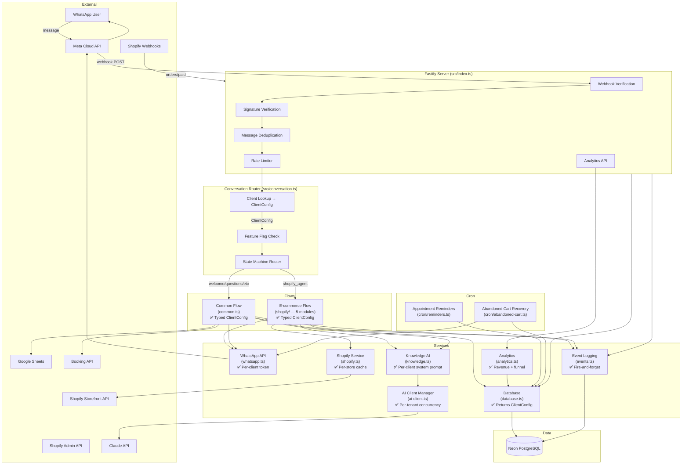

# Codebase & Business Audit Report

**Original audit:** 2026-04-18
**Last updated:** 2026-04-19 (post Phase 2)
**Auditor:** Claude (Staff Engineer / Product Strategist)
**Scope:** Full codebase, architecture, security, business analytics, growth readiness

---

## 1. Executive Summary

You have a working production product that real customers use to buy real products. The bot flow for ARAB is genuinely good — bilingual, graceful degradation, smart reprompting, and payment verification via Shopify webhooks.

Since the original audit, the 10-item priority backlog has been fully completed, plus a Phase 2 batch of 9 additional items:

**Phase 1 (original backlog):**
- **Security hardened:** Secrets rotated, .env removed from git history, customer PII masked in all logs.
- **Codebase restructured:** The 2,430-line shopify-agent.ts monolith was split into 5 focused modules. All client objects are now typed via a `ClientConfig` contract — no more `any` everywhere.
- **Test safety net built:** 93 unit tests covering 19 pure functions. Vitest runs instantly and never flakes.
- **Analytics foundation laid:** Events table captures every key action (messages, checkouts, payments, AI calls, escalations). Revenue attribution queries, conversion funnels, and usage summaries are available via API and CLI.
- **Business features added:** Abandoned cart recovery cron sends checkout link reminders to customers who don't complete payment. Revenue reports show per-client per-month revenue.
- **Documentation fixed:** architecture.md now matches reality (no phantom files, correct PostgreSQL state storage).

**Phase 2 (post-audit hardening):**
- **Token encryption:** Shopify tokens encrypted at rest with AES-256-GCM. Backward compatible with plaintext values.
- **Per-tenant rate limiting:** 200 msg/min per client prevents one tenant from exhausting WhatsApp API limits.
- **Centralized AI client:** Single Anthropic client manager with per-tenant concurrency control (max 5 concurrent).
- **AI cost tracking:** Token counts and latency captured on every AI call — visible via `/api/analytics/ai-cost`.
- **Product analytics:** Top products by checkout frequency — visible via `/api/analytics/products`.
- **Per-client system prompts:** Each client can customize their AI personality via `settings.system_prompt`.
- **Abandoned cart cron activated:** QStash POSTs every 30 minutes to trigger cart recovery.
- **Analytics API live:** `ANALYTICS_KEY` set in production, all 5 endpoints active.
- **Docs cleanup:** README and QUICK_START rewritten to match current codebase (removed stale Redis references).

**What this means for the business:** You can now safely add a second Shopify client (TypeScript enforces the config contract). You can show clients their ROI ("your bot generated X this month"). Abandoned carts get automatic follow-up. Shopify tokens are encrypted at rest. Each client can have their own AI personality. AI costs are tracked per tenant. And you have a test suite that catches regressions before customers see them.

---

## 2. Health Scores

| Area | Before | Now | What changed |
|------|--------|-----|-------------|
| **Code quality** | 5/10 | **7/10** | shopify-agent.ts split into 5 modules. `ClientConfig` type contract across 12 files. Centralized AI client manager. Still has some `any` in scripts. |
| **Multi-tenant cleanliness** | 4/10 | **7/10** | Per-client system prompts. Per-tenant rate limiting (200 msg/min). Per-tenant AI concurrency control (max 5). Remaining gap: no per-client default language, message templates still per-industry. |
| **Security** | 2/10 | **7/10** | Secrets rotated, .env removed from git, PII masked, Shopify tokens encrypted (AES-256-GCM), per-tenant rate limiting. Remaining: no PDPL consent mechanism, data residency question. |
| **Observability** | 2/10 | **7/10** | Events table tracks all key actions. AI cost tracking (tokens + latency per call). 5 analytics API endpoints live. Remaining: no real-time dashboard UI, no alerting on error spikes. |
| **Test coverage** | 1/10 | **5/10** | 93 unit tests covering 19 pure functions. Remaining: no integration tests, no state machine tests, no end-to-end tests. |
| **Documentation** | 6/10 | **7/10** | architecture.md, README, QUICK_START all current. Remaining: no API docs, no runbook, no state machine diagram. |
| **Business analytics** | 1/10 | **8/10** | Revenue, funnel, usage, AI cost, top products — all via API. QStash cron active. CLI reports. Remaining: no dashboard UI. |
| **Growth readiness** | 3/10 | **5/10** | Adding a second Shopify client is a DB insert. Remaining: no self-serve onboarding, no portal. |

---

## 3. Architecture Map



---

## 4. Multi-Tenancy Review

### Where client-specific logic lives today:

| Concern | Where it lives | Status | Notes |
|---------|---------------|--------|-------|
| **Store name, domain** | `clients.settings` (DB) | ✅ Good | Read at runtime via typed `ClientSettings` |
| **Shopify tokens** | `clients.settings` (DB) | ✅ Encrypted | AES-256-GCM via `utils/crypto.ts` |
| **WhatsApp credentials** | `clients.access_token` + `phone_number_id` (DB) | ✅ Good | Per-client, typed in `ClientConfig` |
| **Currency** | `clients.settings.currency` with KWD fallback | ✅ Improved | Typed in `ClientSettings`, read via `getShopifyAgentConfig` |
| **Language/dialect** | Session-level (`conv.data._lang`) | ⚠️ OK | Works but no per-client default language |
| **Tone/personality** | `clients.settings.system_prompt` (DB) | ✅ Done | Per-client override, Gulf Arabic default fallback |
| **Product catalog** | Fetched from Shopify per-domain | ✅ Good | Cached per store+language |
| **System prompts** | `clients.settings.system_prompt` (DB) | ✅ Done | Overrides personality in knowledge.ts, ai-conversation.ts, and shopify/ai.ts |
| **Industry flow** | `clients.industry` in DB, routed in conversation.ts | ✅ Good | Clean routing |
| **Questions** | `clients.questions` in DB | ✅ Good | Per-client, typed as `ClientQuestion[]` |
| **Message templates** | Hardcoded by industry in messages.ts | ⚠️ OK | Per-industry, not per-client |
| **Business hours** | Not implemented | ❌ Not yet | Bot responds 24/7 |
| **Escalation rules** | `client.agent_phones` in DB | ✅ Good | Per-client, typed in `ClientConfig` |
| **Phone prefix → country** | Hardcoded in helpers.ts | ⚠️ OK | Works globally, now in its own module |
| **ARAB setup script** | `src/scripts/setup-arab.ts` | ⚠️ Remains | Client-specific script still in codebase |
| **Feature flags** | `clients.features` in DB | ✅ Good | Typed as `ClientFeatures` |

### Implemented Client Config Contract

The `ClientConfig` interface is now live in `src/types/client.ts`:

```typescript
interface ClientConfig {
  id: string;
  phone_number_id: string;
  name: string;
  industry: string;
  active: boolean;
  access_token: string;
  verify_token?: string;
  features: ClientFeatures;     // typed boolean flags
  settings: ClientSettings;     // typed shopify, currency, booking, etc.
  knowledge_base: KnowledgeItem[];
  questions: ClientQuestion[];
  agent_phones: string[];
}
```

All 12 consumer files now use `ClientConfig` instead of `any`. The database layer returns typed objects. TypeScript enforces the contract at compile time.

---

## 5. File-by-File Health

### Current module structure:

| File/Module | Lines | Status | Notes |
|-------------|-------|--------|-------|
| **src/services/shopify/handlers.ts** | ~670 | ✅ Manageable | State machine + checkout + notifications. Typed with `ClientConfig`. |
| **src/services/shopify/display.ts** | ~340 | ✅ Clean | All WhatsApp UI rendering (products, cart, variants). |
| **src/services/shopify/ai.ts** | ~130 | ✅ Clean | Claude API calls with budget gating. |
| **src/services/shopify/helpers.ts** | ~290 | ✅ Clean | Pure functions: matching, config, cart management. |
| **src/services/shopify/types.ts** | ~55 | ✅ Clean | Shared interfaces and bilingual helper. |
| **src/services/shopify-agent.ts** | 2 | ✅ Barrel | Re-exports `handleShopifyAgent` for backward compat. |
| **src/flows/common.ts** | ~660 | ⚠️ Large | Could extract intent detection + lead completion. |
| **src/messages.ts** | ~440 | ⚠️ Repetitive | 4 similar template sets. Low priority. |
| **src/services/shopify.ts** | ~440 | ✅ Clean | Shopify GraphQL API. Well-structured. |
| **src/services/knowledge.ts** | ~340 | ⚠️ Mixed | Lead scoring + AI service in one file. |
| **src/services/database.ts** | ~270 | ✅ Improved | Returns typed `ClientConfig`. |
| **src/services/events.ts** | ~40 | ✅ Clean | Fire-and-forget event logging. |
| **src/services/analytics.ts** | ~180 | ✅ New | Revenue, funnel, usage queries. |
| **src/cron/abandoned-cart.ts** | ~150 | ✅ New | Cart recovery cron job. |
| **src/types/client.ts** | ~120 | ✅ New | `ClientConfig` contract. |

### What changed from the original audit:

The 2,430-line `shopify-agent.ts` monolith was split into 5 focused modules inside `src/services/shopify/`. A barrel re-export in the original file preserves all existing imports — zero changes needed in files that imported from `shopify-agent.ts`. Each module has one job:

- **handlers.ts** — state machine routing + checkout + owner notifications
- **display.ts** — WhatsApp UI rendering (buttons, lists, images, cart)
- **ai.ts** — Claude API calls with budget management
- **helpers.ts** — pure functions (matching, config, cart ops)
- **types.ts** — shared interfaces and constants

---

## 6. Security & Tenant Isolation

### Completed security items:

| Item | Status | What was done |
|------|--------|---------------|
| Rotate all secrets | ✅ Done | All API keys, tokens, and passwords rotated |
| Remove .env from git history | ✅ Done | BFG Repo Cleaner removed .env from history |
| Stop logging customer PII | ✅ Done | `maskPhone()` applied across all console.log calls |

### Remaining security concerns:

| Area | Status | Detail |
|------|--------|--------|
| Shopify tokens in DB | ✅ Encrypted | AES-256-GCM encryption via `src/utils/crypto.ts`. Backward compatible with plaintext. |
| AI (Claude) client | ✅ Per-tenant | Centralized client manager with per-tenant concurrency control (max 5) in `ai-client.ts`. |
| Product cache | ⚠️ In-memory | Grows unbounded, lost on restart. Correctly isolated by domain. |
| Rate limiting | ✅ Per-tenant | Per-phone (10 msg/min) + per-tenant (200 msg/min) in `rateLimiter.ts`. |
| PDPL compliance | ❌ Missing | No consent collection, no right-to-deletion, no data retention policy |
| Data residency | ⚠️ Singapore | Neon DB in `ap-southeast-1`. PDPL may require KSA residency. |

### Injection Risks

| Risk | Assessment |
|------|-----------|
| Prompt injection | ⚠️ Medium. Customer messages passed into Claude prompts. Bounded by max_tokens (150-400). |
| SQL injection | ✅ Safe. postgres.js parameterized queries throughout. |
| Webhook forgery | ✅ Good. WhatsApp and Shopify both verify HMAC signatures. |

---

## 7. Reliability

| Scenario | What happens | Assessment |
|----------|-------------|------------|
| Claude API fails | Graceful fallback: returns null, bot continues with static flow | ✅ Good |
| Claude API slow | Promise.race timeout (10s), fallback message sent | ✅ Good |
| WhatsApp API fails | fetchWithRetry: 3 retries with exponential backoff | ✅ Good |
| WhatsApp buttons fail | Falls back to plain text message | ✅ Good |
| Shopify API down | Checkout returns null, error message to customer, owner notified | ✅ Good |
| Shopify webhook retry | State checked — skips if already verified | ✅ Good |
| WhatsApp webhook retry | In-memory dedup Map (10 min TTL) | ⚠️ Lost on restart |
| Database down | Errors caught, return null/false. Silent failure. | ⚠️ No retry |
| Server restart | Dedup Map + rate limiter reset. Product cache lost. | ⚠️ Acceptable |
| Double-tap checkout | `_checkoutInProgress` flag prevents duplicates | ✅ Good |
| Abandoned cart | Recovery cron sends checkout link after 1-24h | ✅ New |
| Event logging fails | Fire-and-forget — silently logs error, never blocks bot | ✅ Good |

---

## 8. Observability

### Before: Console.log only. Could not answer any business question.

### Now: Event-based analytics system.

**Events captured:**
| Event | Data | Emitted from |
|-------|------|-------------|
| `message_in` | message length | index.ts (webhook handler) |
| `message_out` | message type | conversation layer |
| `checkout_created` | item count, total, currency, products[] | handlers.ts (processCheckout) |
| `payment_verified` | order number, total, currency | shopify-webhook.ts |
| `ai_call` | source, question count, tokens, duration_ms | ai.ts, common.ts |
| `escalation` | reason | conversation.ts, handlers.ts |
| `lead_captured` | score | common.ts |
| `error` | error details | various |

**Analytics API endpoints** (protected by `ANALYTICS_KEY`):
- `GET /api/analytics/revenue?client_id=X&months=3` — revenue per client per month
- `GET /api/analytics/funnel?client_id=X` — messages → checkouts → payments with conversion rate
- `GET /api/analytics/usage?client_id=X` — messages, AI calls, escalations, checkouts, payments
- `GET /api/analytics/products?client_id=X` — top products by checkout frequency
- `GET /api/analytics/ai-cost?client_id=X` — AI token usage and avg latency per tenant per month

**CLI:** `npx tsx src/scripts/revenue.ts [clientId]` — terminal revenue report.

**Still missing:**
- Real-time dashboard UI
- Alerting on error rate spikes

---

## 9. Testing

### Before: Zero tests. Vitest configured but never used.

### Now: 93 unit tests across 5 test files.

| Test file | Functions tested | Tests |
|-----------|-----------------|-------|
| `buttons.test.ts` | truncate, smartTitle, maskPhone, normalizeArabicNumbers | 22 |
| `shopify-helpers.test.ts` | phoneToCountryCode, isQuestionMessage, matchProduct, matchVariant, tryAnswerProductQuestion, getTopProductsByQuery, smartVariantTitle, formatOrderStatus | 37 |
| `knowledge.test.ts` | detectHandoverIntent, looksLikeQuestion, scoreLead, getScoreLabel | 17 |
| `rateLimiter.test.ts` | checkRateLimit, isConversationExpired | 7 |
| `common.test.ts` | detectPostCompletionIntent | 10 |

All tests are pure function tests — no mocking, no external dependencies. They run in ~350ms.

**Still missing:**
- Integration tests (DB, WhatsApp API)
- State machine transition tests
- Shopify webhook handler tests
- End-to-end conversation flow tests

---

## 10. Documentation & Onboarding

### Fixed:
- architecture.md rewritten — removed nonexistent files (clinic.ts, real-estate.ts, ai.ts), fixed Redis→PostgreSQL claim, added all new modules (events, analytics, shopify/, types/client.ts, abandoned-cart cron)
- CLAUDE.md routing table still accurate

### Still needed:
- API documentation for webhook and analytics endpoints
- Runbook for common production issues
- State machine diagram showing all states and transitions
- "How to add a new Shopify client" step-by-step guide (currently only setup-arab.ts as reference)

---

## 11. Business Intelligence

### Before: No analytics. Zero ability to answer business questions.

### Now: Foundation in place.

**You can now answer:**
| Question | How |
|----------|-----|
| How much revenue did ARAB's bot generate this month? | `GET /api/analytics/revenue?client_id=X` or `npx tsx src/scripts/revenue.ts` |
| What's the conversion rate (messages → paid orders)? | `GET /api/analytics/funnel?client_id=X` |
| How many AI calls is each client using? | `GET /api/analytics/usage` |
| How many customers abandoned their cart? | Compare `checkout_created` vs `payment_verified` events |
| How many conversations escalated to a human? | Count `escalation` events |

**You can now also answer (Phase 2):**
| Question | How |
|----------|-----|
| What's the AI response time per tenant? | `GET /api/analytics/ai-cost?client_id=X` (avg_duration_ms) |
| How many tokens is each client consuming? | `GET /api/analytics/ai-cost?client_id=X` (total_tokens) |
| Which products sell best via the bot? | `GET /api/analytics/products?client_id=X` |

**You still can't answer:**
| Question | What's needed |
|----------|--------------|
| What questions do customers ask most? | Store and cluster AI questions |
| What's the repeat customer rate? | Query by phone across time periods |
| Dashboard showing all metrics visually | Build portal UI or integrate PostHog/Mixpanel |

---

## 12. Strategic Opportunities

These remain unchanged from the original audit. Listed here for reference with updated prerequisites:

| Opportunity | Effort | Prerequisite status |
|-------------|--------|-------------------|
| **Revenue Attribution Dashboard** | S | ✅ Backend ready (5 API endpoints live). Needs UI. |
| **Abandoned Cart Recovery** | S | ✅ Complete — cron active via QStash every 30 min. |
| **Salla & Zid Integration** | M | ✅ Unlocked by shopify/ module split. State machine is now platform-agnostic. |
| **Productized Tiers with Feature Gates** | S | ⚠️ Feature flags exist but no tier→feature mapping enforced. |
| **Voice Note Understanding** | M | No prerequisite changes needed. |
| **Self-Serve Onboarding Wizard** | L | ✅ ClientConfig contract implemented. Portal still empty. |
| **Proactive Marketing Campaigns** | M | No prerequisite changes needed. |
| **Post-Purchase Flows** | S-M | ✅ Events table can track order dates for triggers. |
| **Payment Integration (Tabby, Tamara)** | M | No prerequisite changes needed. |
| **PDPL Compliance** | M | No prerequisite changes needed. |
| **Vision 2030 Alignment** | S | Marketing effort, needs PDPL compliance to back it up. |
| **Referral/Affiliate Program** | S | No prerequisite changes needed. |

### Best-Fit Adjacent Verticals

| Vertical | Fit | Why |
|----------|-----|-----|
| **Restaurants/Food delivery** | ⭐⭐⭐⭐⭐ | Menu = catalog, order = cart. Almost identical to ARAB flow. |
| **Salons/Spas** | ⭐⭐⭐⭐ | Appointment booking already built. Add service catalog. |
| **Real estate** | ⭐⭐⭐⭐ | Lead capture → agent handover. Templates exist. |
| **Tutoring/Education** | ⭐⭐⭐ | Appointment-based. Needs calendar integration. |
| **Logistics/Delivery** | ⭐⭐ | Different model — tracking, not lead capture. |

---

## 13. Completed Backlog

All 10 items from the original priority backlog are done:

| # | Item | Status | Commit |
|---|------|--------|--------|
| 1 | Rotate all secrets | ✅ Done | Guided user through rotation |
| 2 | Remove .env from git history | ✅ Done | BFG Repo Cleaner |
| 3 | Add event logging system | ✅ Done | `events.ts` + `migrations/002_events_table.sql` |
| 4 | Write unit tests | ✅ Done | 93 tests across 19 pure functions |
| 5 | Split shopify-agent.ts | ✅ Done | 5 modules in `src/services/shopify/` |
| 6 | Implement Client Config Contract | ✅ Done | `src/types/client.ts` + 12 files updated |
| 7 | Revenue attribution queries | ✅ Done | `analytics.ts` + API endpoints + CLI script |
| 8 | Abandoned cart recovery | ✅ Done | `cron/abandoned-cart.ts` + endpoint wired |
| 9 | Stop logging customer PII | ✅ Done | `maskPhone()` across all logs |
| 10 | Fix stale documentation | ✅ Done | architecture.md rewritten |

---

## 14. What's Next

Phase 1 (original backlog) and Phase 2 (hardening) are complete. Here's what remains, ordered by effort-to-value ratio:

### Quick wins (S effort, high value)

1. ~~**Activate abandoned cart cron**~~ ✅ Done — QStash active, POSTs every 30 min.
2. ~~**Add ANALYTICS_KEY to production**~~ ✅ Done — all 5 endpoints live.
3. ~~**Per-client system prompts**~~ ✅ Done — `settings.system_prompt` overrides AI personality.

### Medium effort, high value

4. **Dashboard UI** — Build a simple page in the portal that calls the analytics API and shows revenue + funnel charts per client. This is your sales tool for renewals.
5. **Salla integration** — The shopify/ module split makes this possible. Build a `salla/` adapter that implements the same product/checkout interface. Opens the Saudi SMB market.
6. **PDPL compliance basics** — Consent collection at first message, data retention TTL, right-to-deletion endpoint.

### Larger efforts

7. **Self-serve onboarding** — Portal where SMBs sign up, connect WhatsApp, connect Shopify/Salla, go live. Removes you as bottleneck.
8. **Voice note support** — Transcribe WhatsApp voice messages. Big for Gulf customers who prefer speaking over typing.
