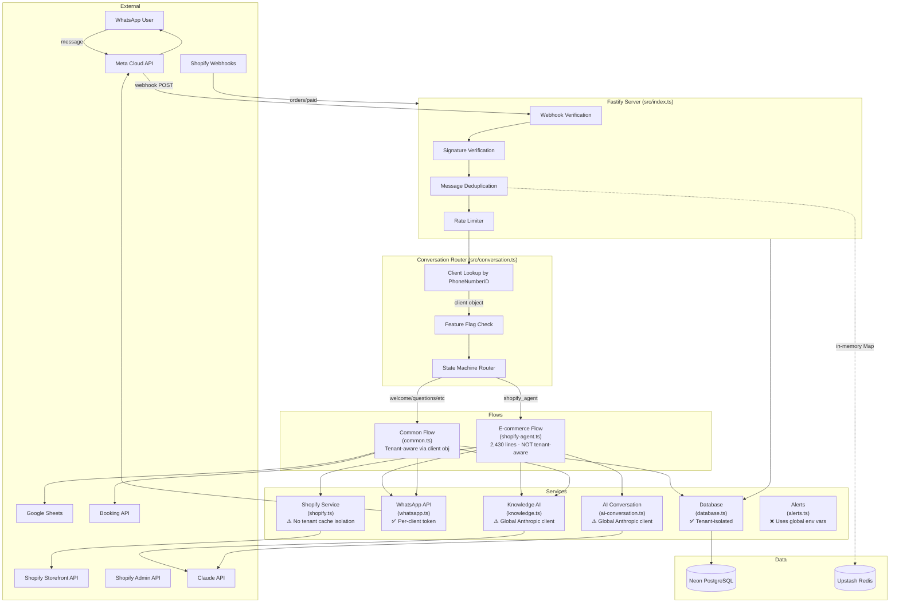

# Codebase & Business Audit Report

**Date:** 2026-04-18
**Auditor:** Claude (Staff Engineer / Product Strategist)
**Scope:** Full codebase, architecture, security, business analytics, growth readiness

---

## 1. Executive Summary

You have a working production product that real customers use to buy real products. That's worth a lot. The bot flow for ARAB is genuinely good — bilingual, graceful degradation, smart reprompting, and payment verification via Shopify webhooks. Most startups at this stage don't have that.

But underneath, the codebase has the structure of a prototype that kept growing. The biggest file (shopify-agent.ts) is 2,430 lines of interleaved state machine, UI rendering, business logic, and client-specific config. There are zero automated tests. Your .env file — with every live secret you own — was committed to git history and is still on disk. And you have no way to answer "how much revenue did the bot generate this month" for any client.

**What this means for the business:** The bot works today, but you can't safely add a second Shopify client, you can't show clients their ROI, and one leaked credential could compromise every client's WhatsApp account and Shopify store simultaneously.

---

## 2. Health Scores

| Area | Score | Why |
|------|-------|-----|
| **Code quality** | 5/10 | Code works and is readable, but shopify-agent.ts is a 2,430-line monolith mixing 5+ concerns. Types are loose (`any` everywhere). No linting enforced. |
| **Multi-tenant cleanliness** | 4/10 | DB queries are correctly scoped by client_id (good). But ARAB-specific config is hardcoded in setup-arab.ts, and shopify-agent.ts has hardcoded KWD currency defaults, Gulf phone prefix maps, and Arabic-first messaging baked in. Adding a second Shopify client means editing core code. |
| **Security** | 2/10 | **Critical.** .env with all live secrets (Anthropic, WhatsApp, DB, Google creds, private keys) exists in git history. Single global WhatsApp access token in env serves as fallback. No secret rotation. Shopify Admin API tokens stored in plaintext JSON in the DB. |
| **Observability** | 2/10 | Console.log only. No structured metrics, no message counts per client, no error rate tracking, no latency measurement. You cannot answer any business question about bot performance. |
| **Test coverage** | 1/10 | Zero test files exist. The `__tests__/` directory referenced in package.json doesn't exist. Vitest is configured but has never been used. Any refactor is a high-wire act. |
| **Documentation** | 6/10 | CLAUDE.md, architecture.md, principles.md, and onboarding docs exist and are reasonably good. But architecture.md references files that don't exist (src/flows/clinic.ts, src/flows/real-estate.ts, src/services/ai.ts) — it's stale. |
| **Business analytics** | 1/10 | No analytics whatsoever. No message counts, no conversion tracking, no revenue attribution. Leads table exists but isn't queryable for business insights. Google Sheets gets raw lead data with no structure. |
| **Growth readiness** | 3/10 | Adding a new clinic client is feasible (DB config + flow). Adding a second Shopify client requires understanding and editing shopify-agent.ts. Self-serve onboarding is impossible. Portal directory is empty. |

---

## 3. Architecture Map



**Key observation:** The entire e-commerce flow (ARAB's main path) runs through shopify-agent.ts, which is NOT properly tenant-aware. It reads config from the client object but has hardcoded defaults (KWD currency, Gulf Arabic tone, phone prefix maps) that assume every Shopify client is a Kuwaiti/Saudi dates retailer.

---

## 4. Multi-Tenancy Review

### Where client-specific logic lives today:

| Concern | Where it lives | How clean | Problem |
|---------|---------------|-----------|---------|
| **Store name, domain** | `clients.settings` (DB) | ✅ Good | Read at runtime |
| **Shopify tokens** | `clients.settings` (DB) | ⚠️ OK | Plaintext JSON, no encryption |
| **WhatsApp credentials** | `clients.access_token` + `phone_number_id` (DB) | ✅ Good | Per-client, used correctly |
| **Currency** | `clients.settings.currency` with KWD fallback in shopify-agent.ts:550,1479 | ❌ Bad | Hardcoded KWD fallback should be SAR or configurable |
| **Language/dialect** | Session-level (`conv.data._lang`) | ⚠️ OK | Works but no per-client default language |
| **Tone/personality** | Hardcoded Gulf Arabic in knowledge.ts:30-48 and shopify-agent.ts:141-148 | ❌ Bad | Every client gets same personality |
| **Product catalog** | Fetched from Shopify per-domain | ✅ Good | Cached per store+language |
| **System prompts** | Hardcoded in knowledge.ts and ai-conversation.ts | ❌ Bad | Same prompt for all clients |
| **Industry flow** | `clients.industry` in DB, routed in conversation.ts | ✅ Good | Clean routing |
| **Questions** | `clients.questions` in DB | ✅ Good | Per-client override works |
| **Message templates** | Hardcoded by industry in messages.ts | ⚠️ OK | Per-industry, not per-client |
| **Business hours** | Not implemented | ❌ Missing | Bot responds 24/7, no after-hours mode |
| **Escalation rules** | `client.agent_phones` in DB | ✅ Good | Per-client |
| **Phone prefix → country** | Hardcoded in shopify-agent.ts:103-114 | ⚠️ OK | Works globally but shouldn't be in agent file |
| **ARAB setup script** | `src/scripts/setup-arab.ts` | ❌ Bad | Client-specific script in core codebase |
| **Feature flags** | `clients.features` in DB | ✅ Good | Clean per-client |
| **Pricing tier** | In code via features-cli.ts | ⚠️ OK | CLI-based, not self-serve |

### Proposed Client Config Contract

Every client should be expressible as a single typed object:

```typescript
interface ClientConfig {
  // Identity
  id: string;
  name: string;                    // "ARAB | عرب"
  industry: 'ecommerce' | 'clinic' | 'real_estate' | 'car_dealership' | 'generic';
  tier: 'basic' | 'pro' | 'business';
  active: boolean;

  // Language & Tone
  defaultLanguage: 'ar' | 'en';
  dialect: 'gulf' | 'egyptian' | 'levantine' | 'formal';
  systemPrompt?: string;           // Override for AI personality
  welcomeMessage?: string;

  // Integration Credentials
  whatsapp: {
    phoneNumberId: string;
    accessToken: string;
  };
  shopify?: {
    domain: string;
    storefrontToken?: string;
    adminToken?: string;
    webhookSecret?: string;
  };
  googleSheets?: {
    sheetId: string;
  };
  bookingApi?: {
    url: string;
    clinicId: string;
  };

  // Product & Catalog
  currency: string;                // "KWD", "SAR"
  catalogSource: 'shopify' | 'manual' | 'salla';

  // Flow Configuration
  questions: Question[];
  features: ClientFeatures;
  appointmentSettings?: AppointmentSettings;
  businessHours?: BusinessHours;

  // Escalation
  agentPhones: string[];
  ownerPhone?: string;
  escalationRules?: EscalationRules;

  // Knowledge Base
  knowledgeBase: KnowledgeItem[];
}
```

**ARAB expressed in this contract:**

```typescript
const arabConfig: ClientConfig = {
  id: 'client_arab_...',
  name: 'ARAB | عرب',
  industry: 'ecommerce',
  tier: 'pro',
  active: true,
  defaultLanguage: 'ar',
  dialect: 'gulf',
  whatsapp: {
    phoneNumberId: '868668139674542',
    accessToken: '...',
  },
  shopify: {
    domain: 'hsespd-dv.myshopify.com',
    webhookSecret: '...',
  },
  currency: 'KWD',
  catalogSource: 'shopify',
  questions: [],
  features: {
    ai_fallback: true,
    lead_scoring: true,
    handover_detection: true,
    appointment_setting: false,
    ai_conversation: false,
  },
  agentPhones: ['+965...'],
  knowledgeBase: [],
};
```

---

## 5. File-by-File Health

### Files over 300 lines:

| File | Lines | What it does | What's mixed in | Proposed split |
|------|-------|-------------|-----------------|----------------|
| **shopify-agent.ts** | 2,430 | **Priority 1.** Complete Shopify e-commerce state machine: welcome, browse, catalog, image cards, product view, variant select, quantity, cart, checkout, payment, order status, customer service, owner notifications, AI Q&A, product matching, cart management, and UI rendering. | (1) State machine routing, (2) WhatsApp UI rendering (buttons, lists, cards), (3) Cart/order data management, (4) AI question answering, (5) Owner notifications, (6) Product matching/search, (7) Shopify checkout, (8) Config extraction, (9) Hardcoded bilingual strings | Split into: `shopify-agent/router.ts` (state machine), `shopify-agent/views.ts` (UI rendering), `shopify-agent/cart.ts` (cart ops), `shopify-agent/checkout.ts` (payment flow), `shopify-agent/notifications.ts` (owner alerts), `shopify-agent/product-search.ts` (matching/AI) |
| **common.ts** | 666 | Shared flow handlers: welcome, questions, appointments, AI, chat, handover, lead completion | Post-completion intent detection (should be a utility), lead completion (DB writes mixed with message sending) | Manageable but intent detection + lead completion could be extracted |
| **messages.ts** | 442 | Industry-specific message templates | 4 nearly-identical template sets (real estate, clinic, car, generic) differing only in a few words | Could be a single template with per-industry word substitutions, but low priority — it works |
| **shopify.ts** | 438 | Shopify GraphQL Storefront API | Clean. Well-structured. No issues. | No split needed |
| **client-cli.ts** | 435 | Interactive CLI for adding clients | axios import (only file using it), readline-based UI | OK for a CLI tool |
| **knowledge.ts** | 337 | AI knowledge base, lead scoring, handover detection | Lead scoring mixed with AI service | Could extract lead scoring, but low priority |

### shopify-agent.ts dissection (Priority 1):

```
Lines 1-90:     Config, types, product cache, bilingual helper
Lines 91-228:   AI question answering (budget, isQuestion, answerWithAI, tryAIAnswer)
Lines 230-356:  Main handler + state machine switch
Lines 357-582:  Welcome state (language selection, intent menu, session resume, product fetch)
Lines 583-656:  Browse choice state
Lines 657-773:  Image browse + catalog selection states
Lines 774-867:  Product view + variant select states
Lines 868-1002: Quantity select + cart states
Lines 1003-1257: Cart remove + payment confirmation + order complete + done states
Lines 1258-1425: Order status state (Admin API lookup)
Lines 1426-1460: Customer service state
Lines 1462-1615: Helpers (config, matching, cart management, order history, reset)
Lines 1616-1815: Cart display, checkout processing
Lines 1816-1930: Owner notifications (4 notification types)
Lines 1931-2270: UI rendering (product list, product names/images, quantity ask)
Lines 2271-2430: Product search (pattern matching, top products, show top products)
```

**What this means for the business:** Every time you fix a cart bug, you're editing the same file that handles payment verification, AI questions, and owner notifications. One wrong edit could break the entire e-commerce flow for ARAB. Splitting this file is the single most important technical improvement you can make.

---

## 6. Security & Tenant Isolation

### CRITICAL: Secrets in Git History

Your `.env` file was committed to git (commit `367c2b98`). Even though it's now gitignored, **every secret is permanently in git history**:
- Anthropic API key
- OpenAI API key
- WhatsApp access token
- Database connection string (Neon)
- Google service account private key (full PEM)
- Redis credentials
- Admin API key
- Encryption key
- Owner phone number

**Anyone with access to this repo can extract all of these.** If this is a private repo, the risk is limited to collaborators. If it was ever public, even briefly, all these secrets must be considered compromised.

**Immediate action needed:**
1. Rotate ALL secrets listed above
2. Use `git filter-repo` or BFG to remove .env from git history
3. Move secrets to Render's environment variables (which you may already be doing for production, but the .env on disk is the local dev risk)

### Tenant Isolation Assessment

| Area | Status | Detail |
|------|--------|--------|
| DB query scoping | ✅ Good | Every query includes `client_id` or `phone_number_id` WHERE clause |
| Conversation isolation | ✅ Good | Keyed by (client_id, phone) with UNIQUE constraint |
| WhatsApp token per client | ✅ Good | `client.access_token` used for sends |
| Shopify creds per client | ✅ Good | Stored in `client.settings`, read at runtime |
| AI (Claude) client | ❌ Shared | Single global Anthropic client with one API key for all tenants. If one client's AI usage spikes, it affects all clients' rate limits |
| Anthropic API key | ❌ Global | Single key in .env. No per-tenant key support |
| Product cache | ⚠️ Weak | Cache key is `${domain}_${lang}` — correct isolation, but in-memory Map means cache doesn't survive restarts and grows unbounded |
| Rate limiting | ⚠️ Per-phone only | Rate limit is per customer phone, not per client/tenant. A client with many customers could exhaust your WhatsApp API rate limit, affecting other clients |
| Alert system | ❌ Global | `alerts.ts` uses `OWNER_PHONE` from env — alerts go to YOUR phone, not the client's |

### Injection Risks

| Risk | Assessment |
|------|-----------|
| Prompt injection via customer message | ⚠️ Medium. Customer messages are passed directly into Claude prompts (knowledge.ts:132, shopify-agent.ts:153). The system prompts are reasonably bounded, and max_tokens is low (150-400), limiting damage. But a crafty customer could extract the system prompt or get the bot to say something off-brand. |
| SQL injection | ✅ Safe. postgres.js uses parameterized queries throughout. |
| XSS | ✅ N/A — no web frontend rendering user content. |
| Webhook forgery | ✅ Good. Both WhatsApp and Shopify webhooks verify HMAC signatures. |

### PII / PDPL Compliance

| Concern | Status |
|---------|--------|
| Customer phone numbers in logs | ❌ Logged in plaintext: `console.log('Message from ' + customerPhone + ': ' + messageText)` — this logs every customer message with their phone number |
| Customer data in conversation JSON | ⚠️ Full conversation history stored as JSON blob in DB, including names, phone numbers, and all messages. No TTL or auto-deletion |
| Right to deletion | ❌ No mechanism to delete a customer's data on request |
| Data residency | ⚠️ Neon DB is in `ap-southeast-1` (Singapore). PDPL may require Saudi data to stay in KSA or have explicit consent for cross-border transfer |
| Consent | ❌ No explicit consent collection before processing personal data |

**What this means for the business:** If a Saudi regulator asks "where is your customers' data, who has access, and can you delete it on request," you cannot answer any of these questions today. PDPL enforcement is ramping up in 2026 — this is a ticking clock, not a nice-to-have.

---

## 7. Reliability

| Scenario | What happens | Assessment |
|----------|-------------|------------|
| Claude API fails | Graceful fallback: returns null/default message, bot continues with static flow | ✅ Good |
| Claude API slow (>10-15s) | Promise.race timeout kicks in, fallback message sent | ✅ Good |
| WhatsApp API fails | fetchWithRetry: 3 retries with exponential backoff on 429/5xx | ✅ Good |
| WhatsApp API buttons fail | Falls back to plain text message | ✅ Good |
| Shopify Storefront API down | Checkout returns null, error message to customer, owner notified | ✅ Good |
| Shopify webhook retry | Conversation state checked — if already verified, skips duplicate | ✅ Good |
| WhatsApp webhook retry | In-memory dedup Map tracks message IDs for 10 minutes | ⚠️ OK (lost on restart) |
| Redis down | Redis is referenced in architecture.md but NOT ACTUALLY USED in code. Conversation state is in PostgreSQL. Package.json has no Redis client. The REDIS_URL in .env is unused. | ⚠️ Misleading docs |
| Database down | DB errors caught, return null/false. Bot silently fails. No retry. | ⚠️ Could be better |
| Server restart | In-memory dedup Map and rate limiter reset. Could process duplicate messages briefly. Product cache lost. | ⚠️ Acceptable |
| Double-tap on checkout | Guard: `conv.data._checkoutInProgress` flag prevents duplicate checkouts | ✅ Good |
| Long-running payment | 2-hour timeout with recovery flow offered | ✅ Good |

**Missing:**
- No circuit breaker for external APIs
- No dead-letter queue for failed webhooks
- No idempotency key on Shopify cart creation (relies on conversation state)
- No health check for external dependencies (Shopify, Claude, Neon)

---

## 8. Observability

**Current state:** You have `console.log` statements. That's it.

You cannot answer:
- How many messages did ARAB's bot handle yesterday?
- How many led to a checkout? How many led to a paid order?
- What's the error rate?
- What's the average response time?
- What questions do customers ask most?
- How many customers abandon at the payment step?
- How much revenue went through the bot this month?

**What you need:**
1. **Event logging** — structured JSON events for: message_received, message_sent, checkout_created, payment_verified, ai_called, error_occurred — each tagged with client_id
2. **Metrics** — counters and histograms stored in the DB or a service like PostHog/Mixpanel
3. **A dashboard** — even a simple SQL query page showing daily/weekly stats per client

---

## 9. Testing

**Current state:** Zero tests. The `src/__tests__/` directory doesn't exist. Vitest is installed and configured but never used.

**Riskiest gaps:**
1. **shopify-agent.ts state machine** — no tests for any of the 15+ states. A refactor here is playing with fire.
2. **Shopify webhook handler** — payment verification, phone normalization, state transitions — all untested
3. **Conversation router** — state reset logic, timeout calculations, flow routing — untested
4. **Product matching** — Arabic text matching, button ID parsing — untested
5. **AI response parsing** — `[DATA:key=value]`, `[BUTTONS:...]`, `[COMPLETE]` tag extraction — untested

**What this means for the business:** Any change to the bot's behavior is essentially a manual QA process where you test on live WhatsApp. If something breaks, customers see it first.

---

## 10. Documentation & Onboarding

**Good:**
- CLAUDE.md provides clear routing table for AI assistants
- architecture.md explains the request flow
- principles.md is opinionated and useful
- ARAB_ONBOARDING.md is a solid client setup checklist
- ONBOARDING_GUIDE.md and CLINIC_SETUP.md exist

**Problems:**
- architecture.md references files that don't exist: `src/flows/clinic.ts`, `src/flows/real-estate.ts`, `src/services/ai.ts`
- architecture.md says state lives in Redis — it actually lives in PostgreSQL
- No API documentation for the webhook endpoints
- No runbook for common production issues
- No explanation of the conversation state machine states and transitions
- `setup-arab.ts` is the only "how to add a Shopify client" documentation, and it's a script, not a guide

**If you hired a contractor tomorrow:** They could understand the architecture from docs, but they'd be lost trying to modify the Shopify flow without reading all 2,430 lines of shopify-agent.ts. They'd also have no tests to catch regressions.

---

## 11. Business Intelligence Gap Analysis

### What you should be able to see but can't:

| Metric | Why it matters | Difficulty to add |
|--------|---------------|-------------------|
| **Messages handled per client per day** | Basic usage metric, basis for tiered pricing | Easy — count events |
| **Conversion funnel:** message → browse → cart → checkout → paid | Shows where customers drop off | Medium — requires event logging at each state transition |
| **Revenue attributable to bot per client per month** | "The bot closed 42,000 SAR for you this month" changes your renewal conversation | Medium — Shopify webhook already has order totals, just need to aggregate |
| **Cart abandonment rate** | % who start checkout but don't pay | Easy — compare checkout_created vs payment_verified |
| **Average cart value** | Pricing and upsell insight | Easy — aggregate from checkout data |
| **Response time P50/P95** | Service quality metric | Medium — timestamp messages in/out |
| **Containment rate** | % of conversations resolved without human | Medium — track escalations vs total conversations |
| **AI call count per client** | Cost allocation | Easy — counter per AI call |
| **Top customer questions** | Product/FAQ insight for clients | Medium — store and cluster AI questions |
| **Repeat customer rate** | Loyalty metric | Easy — query conversations by phone |
| **Error rate per client** | Reliability metric | Easy — count errors per client_id |
| **Churn signals** | Clients whose message volume is declining | Medium — trend analysis on message counts |

### Proposed Analytics Schema

```sql
CREATE TABLE events (
  id BIGSERIAL PRIMARY KEY,
  client_id TEXT NOT NULL,
  event_type TEXT NOT NULL,        -- message_in, message_out, checkout, payment, ai_call, error, escalation
  customer_phone TEXT,
  data JSONB DEFAULT '{}',         -- event-specific payload
  created_at TIMESTAMPTZ DEFAULT NOW()
);

CREATE INDEX idx_events_client_date ON events (client_id, created_at);
CREATE INDEX idx_events_type ON events (event_type, created_at);
```

### Dashboard Spec for Portal

```
Client Dashboard (per-client view):
  - Today's messages: [count] | This week: [count] | This month: [count]
  - Conversion funnel bar chart: Browse → Cart → Checkout → Paid
  - Revenue this month: [amount] SAR/KWD
  - Top 5 products by sales
  - Cart abandonment rate: [%]
  - AI calls used: [count] / [limit]
  - Response time: P50 [x]s, P95 [x]s
  - Recent conversations (last 10, clickable)

Admin Dashboard (your view):
  - All clients: message volume, revenue, error rate
  - Total AI cost estimate
  - System health: uptime, error rate, webhook latency
```

---

## 12. Strategic Opportunities

### Opportunity 1: Revenue Attribution Dashboard
**What:** Show each client exactly how much money the bot generated for them.
**Effort:** S (small) — data already flows through Shopify webhook, just needs aggregation + display.
**Lift:** This is your #1 retention tool. "Your bot generated 42,000 KWD in sales this month" makes renewal a no-brainer and justifies price increases.
**Code prerequisite:** Events table + basic API endpoint.

### Opportunity 2: Abandoned Cart Recovery
**What:** When a customer creates a checkout but doesn't pay within X hours, the bot sends a follow-up WhatsApp message with the payment link.
**Effort:** S — checkout URL and cart data already stored in conversation. Just need a cron job to find stale `awaiting_payment` conversations and send a nudge.
**Lift:** Industry average cart recovery rate is 5-15%. If ARAB sees 10 abandoned carts/week, recovering 1-2 is pure incremental revenue.
**Code prerequisite:** Cron job + conversation query.

### Opportunity 3: Salla & Zid Integration
**What:** Support Salla and Zid (the two biggest Saudi e-commerce platforms) alongside Shopify.
**Effort:** M — need to build Salla/Zid API adapters that implement the same product/checkout interface as shopify.ts. The shopify-agent.ts state machine is already catalog-agnostic in principle; it just needs the plumbing split.
**Lift:** Opens your addressable market 10x in Saudi Arabia. Most Saudi SMBs are on Salla, not Shopify. This is the most defensible moat: international competitors won't build Salla integrations.
**Code prerequisite:** Split shopify-agent.ts so the state machine is platform-agnostic, then swap the catalog/checkout backend.

### Opportunity 4: Productized Tiers with Feature Gates
**What:** Clear Starter/Pro/Enterprise pricing with feature gates enforced in code.
**Effort:** S — feature flags already exist in `clients.features`. Just need to formalize which features map to which tier and build a simple tier-checking utility.
**Lift:** Raises ARPU, makes upsell path clear. "Want abandoned cart recovery? That's Pro." Also, you should be charging more. 500 SAR/month for a bot that handles sales is underpriced if you can prove ROI.
**Code prerequisite:** Tier → feature mapping, enforced in conversation.ts.

**Suggested tiers:**
| | Starter (500 SAR) | Pro (1,200 SAR) | Enterprise (2,500 SAR) |
|---|---|---|---|
| Lead capture | ✅ | ✅ | ✅ |
| WhatsApp automation | ✅ | ✅ | ✅ |
| Google Sheets sync | ✅ | ✅ | ✅ |
| AI Q&A (2/session) | ❌ | ✅ | ✅ |
| AI conversation mode | ❌ | ✅ | ✅ |
| Lead scoring | ❌ | ✅ | ✅ |
| Cart abandonment recovery | ❌ | ✅ | ✅ |
| Revenue dashboard | ❌ | ✅ | ✅ |
| Voice note support | ❌ | ❌ | ✅ |
| Custom system prompt | ❌ | ❌ | ✅ |
| PDPL compliance tools | ❌ | ❌ | ✅ |
| White-label | ❌ | ❌ | ✅ |
| Dedicated support | ❌ | ❌ | ✅ |

### Opportunity 5: Voice Note Understanding
**What:** WhatsApp voice notes are huge in the Gulf. Currently the bot returns `[voice]` and does nothing. Transcribe voice notes using Whisper/Claude and process them as text.
**Effort:** M — need to download the audio via WhatsApp API, transcribe, then feed into the existing text flow.
**Lift:** Captures a significant chunk of messages you're currently ignoring. Many Gulf customers prefer voice over typing, especially older demographics. This is a defensible feature — international chatbot tools don't do Arabic voice well.
**Code prerequisite:** WhatsApp media download, audio transcription service.

### Opportunity 6: Self-Serve Onboarding Wizard
**What:** A web portal where a new SMB can sign up, connect their WhatsApp number, connect Shopify/Salla, and go live without your manual involvement.
**Effort:** L — requires the portal (currently empty Next.js shell), WhatsApp Business API embedded signup flow, and the Client Config Contract to be implemented.
**Lift:** Removes you as the bottleneck for growth. Every new client currently requires you to manually add DB records. This doesn't scale past 10-20 clients.
**Code prerequisite:** Client Config Contract, portal, embedded signup.

### Opportunity 7: Proactive WhatsApp Marketing Campaigns
**What:** Let clients send broadcast messages to their customer list — new product launches, sales, holiday promotions (Ramadan, National Day, Eid).
**Effort:** M — requires WhatsApp template messages (pre-approved by Meta), a campaign scheduling UI, and opt-in management for PDPL compliance.
**Lift:** Monthly recurring engagement. Clients pay for the bot AND for campaigns. This is how conversational commerce platforms (like Zoko, Wati) make real money.
**Code prerequisite:** Template message support, customer list management, opt-in tracking.

### Opportunity 8: Post-Purchase Flows
**What:** After a purchase: NPS survey, review collection (send to Google/Shopify), reorder prompt after N days.
**Effort:** S-M — cron-triggered messages based on order date.
**Lift:** Increases repeat purchase rate and generates social proof for clients' stores. "Your bot collected 23 five-star reviews this month."
**Code prerequisite:** Scheduled message system, NPS/review templates.

### Opportunity 9: Payment Integration (Tabby, Tamara, HyperPay, Mada)
**What:** Saudi customers use BNPL (Buy Now Pay Later) heavily. Tabby and Tamara are the dominant players. Show BNPL options alongside regular checkout.
**Effort:** M — Tabby/Tamara have merchant APIs for creating payment sessions.
**Lift:** Increases conversion by 20-30% according to BNPL providers. "Pay in 4 installments" is a huge conversion driver in KSA.
**Code prerequisite:** Payment provider abstraction.

### Opportunity 10: PDPL Compliance as Enterprise Feature
**What:** Consent collection, data retention policies, right-to-deletion, data residency controls, audit logs.
**Effort:** M — requires consent flow, data deletion API, and potentially moving to a KSA-region database.
**Lift:** Regulatory requirement that becomes a sales tool: "We're PDPL compliant — are your competitors?" Also justifies Enterprise tier pricing.
**Code prerequisite:** Consent tracking, data deletion, audit logging.

### Opportunity 11: Vision 2030 / SDAIA Alignment
**What:** Saudi Arabia's Vision 2030 and SDAIA (Saudi Data & AI Authority) are actively promoting AI adoption in the private sector. Position your product as Vision 2030-aligned.
**Effort:** S (marketing, not code) — but code needs PDPL compliance and Arabic-first AI to back up the claim.
**Lift:** Opens doors to government-adjacent contracts, accelerator programs, and grants. "Arabic-first AI commerce platform" is a strong narrative.
**Code prerequisite:** PDPL compliance, Arabic prompt library.

### Opportunity 12: Referral/Affiliate Program
**What:** Existing clients refer other SMBs, get a discount or commission.
**Effort:** S — referral code tracking, discount application.
**Lift:** Lowest-cost customer acquisition channel. Saudi business networks are relationship-driven — word of mouth is powerful.
**Code prerequisite:** Referral tracking in client records.

### Best-Fit Adjacent Verticals

| Vertical | Fit with current engine | Why |
|----------|------------------------|-----|
| **Restaurants/Food delivery** | ⭐⭐⭐⭐⭐ | Menu = product catalog, order = cart + checkout. Almost identical to ARAB flow. Foodics integration would unlock the market. |
| **Salons/Spas** | ⭐⭐⭐⭐ | Appointment booking already built. Add service catalog + online payment. |
| **Tutoring/Education** | ⭐⭐⭐ | Appointment-based. Would need calendar integration. |
| **Real estate** | ⭐⭐⭐⭐ | Already built (messages.ts has templates). Lead capture → agent handover. |
| **Logistics/Delivery** | ⭐⭐ | Different — needs tracking integration, not lead capture. |

---

## 13. Prioritized Backlog

| # | Item | Tag | Effort | Impact | Why |
|---|------|-----|--------|--------|-----|
| 1 | **Rotate all secrets** — .env is in git history. Rotate every API key, DB password, and token immediately. | [Security] | S | Critical | One leaked repo access = total compromise |
| 2 | **Remove .env from git history** — use BFG Repo Cleaner | [Security] | S | Critical | Prevents future leaks from clones/forks |
| 3 | **Add basic event logging** — events table + emit events at key points (message in/out, checkout, payment, error) | [Business] | S | High | Foundation for every analytics and BI feature. Without this, you're flying blind. |
| 4 | **Write tests for shopify-agent.ts core paths** — state transitions, product matching, cart operations, checkout | [Tech] | M | High | Safety net before any refactoring |
| 5 | **Split shopify-agent.ts** into 5-6 focused modules | [Tech] | M | High | Unlocks ability to add second Shopify client, makes code maintainable |
| 6 | **Implement Client Config Contract** — typed config per tenant, replace hardcoded ARAB defaults | [Tech] | M | High | Unlocks proper multi-tenancy |
| 7 | **Revenue attribution query** — SQL that shows revenue per client per period from events + Shopify webhook data | [Business] | S | High | "Your bot made you X this month" = retention superpower |
| 8 | **Abandoned cart recovery cron** — find stale `awaiting_payment` convos, send follow-up message | [Business] | S | High | Pure incremental revenue, very low effort |
| 9 | **Stop logging customer PII** — remove phone numbers and message content from console.log, or at minimum mask them | [Security] | S | Medium | PDPL compliance, good practice |
| 10 | **Fix stale documentation** — update architecture.md (remove nonexistent files, fix Redis claim), add state machine diagram | [Tech] | S | Medium | Next contractor won't be confused |

### Next 30 days recommended order:

**Week 1:** Items 1, 2, 9 (security — do these today)
**Week 2:** Items 3, 10 (observability foundation + docs)
**Week 3:** Item 4 (tests for core paths)
**Week 4:** Items 5, 6 (refactor with test safety net), then 7, 8 (quick business wins)

---

## Menu: What Should I Start On?

Reply with the numbers you want me to tackle. I'll work through them in order, one commit at a time, with a plain-English summary after each step.

```
1  — Rotate secrets (I'll tell you which ones and guide you through it)xx
2  — Remove .env from git history xx
3  — Add event logging system (events table + key emitters) -- commit ??
4  — Write tests for shopify-agent.ts core paths
5  — Split shopify-agent.ts into focused modules
6  — Implement Client Config Contract
7  — Revenue attribution queries
8  — Abandoned cart recovery
9  — Stop logging customer PII xx
10 — Fix stale documentation
11 — All security items first (1+2+9), then the rest in order
12 — Skip to business wins (7+8) — I want to show clients ROI NOW
13 — Give me a different plan (tell me what you'd prioritize)
```
